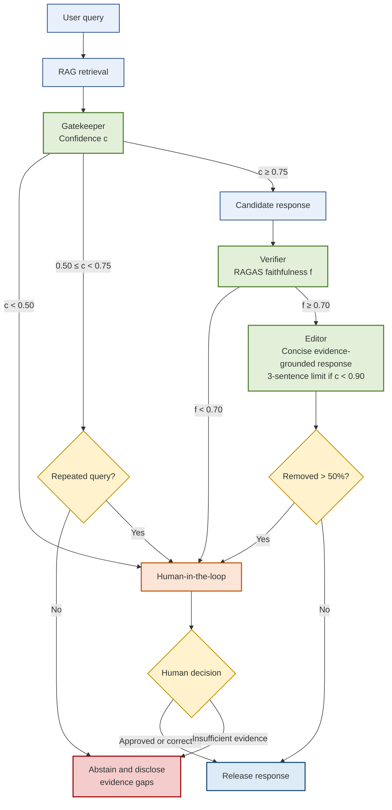
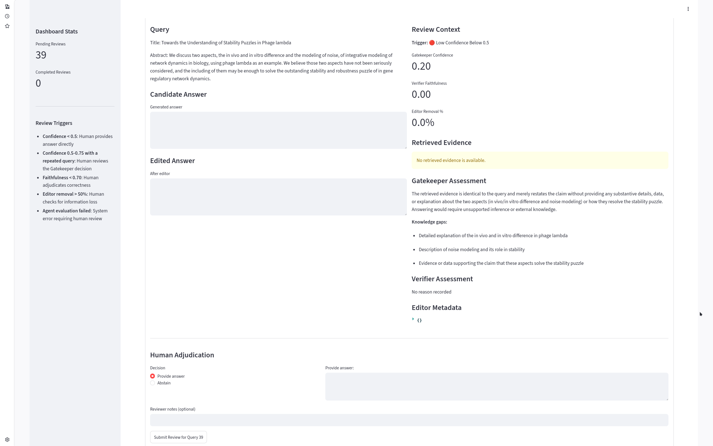

# Multi-Agent Hallucination Detection Framework

A multi-agent framework for detecting and mitigating hallucinations in educational question-answering systems. The framework combines specialized agents (Gatekeeper, Verifier, Editor) with human-in-the-loop review for high-stakes decisions.

## Architecture

The framework follows a sequential pipeline where each agent performs a specialized role:



*Figure 1: Multi-agent pipeline showing decision flow and human-in-the-loop integration.*



*Figure 2: Human-in-the-loop review dashboard for adjudicating uncertain responses.*

## Components

### Agents

| Agent | Role | Threshold | Output |
|-------|------|-----------|--------|
| Gatekeeper | Evaluates evidence sufficiency | Confidence < 0.75 -> Abstain | Confidence score, knowledge gaps |
| Verifier | Fact-checks candidate responses | Faithfulness < 0.70 -> HITL | Faithfulness score, unsupported claims |
| Editor | Compresses responses, removes unsupported content | Removal > 50% -> HITL | Concise response |

### Human-in-the-Loop Triggers

| Trigger | Condition | Action |
|---------|-----------|--------|
| Low confidence | Gatekeeper confidence < 0.5 | Human provides answer directly |
| Medium confidence + repeated | 0.5 <= confidence < 0.75 + repeated query | Human reviews Gatekeeper decision |
| Low faithfulness | Verifier faithfulness < 0.70 | Human adjudicates correctness |
| Excessive removal | Editor removes > 50% of content | Human checks for information loss |

## Dataset

The benchmark dataset consists of:

- 5,178 source records from arXiv, PubMed Central, Biology Stack Exchange, and Wikipedia
- 41,424 original-hallucinated pairs (5,178 x 8 error types)
- 8 controlled hallucination types:
  - Entity Replacement
  - Numerical Distortion
  - Negation Flip
  - Temporal Confusion
  - Causal Reversal
  - Plausible Fabrication
  - Oversimplification
  - Citation Hallucination
- Generated by 3 models: `deepseek-v4-flash`, `gpt-oss-120b`, `qwen3-235b-a22b-fp8`

## Results

| Configuration | Mean Faithfulness | Pass Rate | HITL |
|--------------|-------------------|-----------|------|
| Single-agent (best) | 0.633 | 57.8% | - |
| Homogeneous (best) | 0.714 | 75.0% | 16.8% |
| Heterogeneous (best) | 0.772 | 86.1% | 12.9% |

Heterogeneous multi-agent improves faithfulness by +0.058 over best homogeneous and +0.139 over best single-agent.

## Quick Start

### 1. Setup

```bash
git clone <repo>
cd educational_fluency

python -m venv .venv
source .venv/bin/activate
pip install -r requirements.txt

cp .env.example .env
# Edit .env with your YANDEX_API_KEY and YANDEX_FOLDER_ID
```

### 2. Generate Hallucination Pairs

```bash
python scripts/generate_hallucinated_pairs.py data/raw_data.json data/hallucination_pairs.jsonl
```

### 3. Run Evaluation

```bash
# Quick test (10 samples)
python run_tests.py --mode quick --data data/hallucination_pairs.jsonl

# Development mode (2,000 samples)
python run_tests.py --mode dev --data data/hallucination_pairs.jsonl

# Full evaluation (41,424 samples)
python run_tests.py --mode full --data data/hallucination_pairs.jsonl
```

### 4. Review HITL Cases

```bash
streamlit run dashboard.py
```

## Project Structure

```
educational_fluency/
├── assets/
│   ├── fig1/
│   │   └── pipeline.png          # Architecture diagram
│   └── fig2/
│       └── dashboard.png         # HITL review dashboard
├── data/
│   ├── raw_data.json             # Source records
│   └── hallucination_pairs.jsonl # Generated pairs
├── src/
│   └── agents/
│       ├── gatekeeper.py
│       ├── verifier.py
│       ├── editor.py
│       └── orchestrator.py
├── scripts/
│   ├── generate_hallucinated_pairs.py
│   └── get_raw_data_stats.py
├── results/
│   ├── hitl_queue.json           # Pending HITL reviews
│   ├── hitl_reviewed.json        # Completed reviews
│   └── evaluation_results_*.json # Evaluation outputs
├── dashboard.py
├── run_tests.py
├── config.yaml
├── requirements.txt
└── README.md
```

## Configuration

Example `config.yaml`:

```yaml
pipeline:
  temperature: 0.3
  max_tokens: 512

gatekeeper:
  confidence_threshold: 0.75
  low_confidence_threshold: 0.50

verifier:
  faithfulness_threshold: 0.70

editor:
  max_sentences_low_confidence: 3
  confidence_threshold_for_compression: 0.9
  max_removal_percentage: 0.5
```

## Environment Variables

```bash
# .env
API_KEY=your_api_key_here
API_BASE=https://api.yandexcloud.net/v1
```

## License

MIT

## Citation

```bibtex
tba
```


