# Multi-Agent Hallucination Detection Framework

A multi-agent framework for detecting and mitigating hallucinations in educational question-answering systems. The framework combines specialized agents (Gatekeeper, Verifier, Editor) with human-in-the-loop review for high-stakes decisions.

## Architecture

The framework supports two architectural variants:

### Architecture A: Post-Editing
Pipeline: **Gatekeeper → Generator → Verifier → Editor**

The Verifier evaluates the unedited candidate, then the Editor compresses the response.

### Architecture B: Pre-Editing (Recommended)
Pipeline: **Gatekeeper → Generator → Editor → Verifier**

The Editor compresses the response **before** the Verifier evaluates it. This ensures the Verifier assesses exactly what will be released, reducing unnecessary HITL triggers.

```mermaid
flowchart TD
    subgraph ArchA["Architecture A: Post-Editing"]
        direction LR
        Q1["User query"] --> R1["RAG retrieval"]
        R1 --> G1["Gatekeeper<br/>Confidence c"]
        G1 -->|"c < 0.50"| H1["HITL"]
        G1 -->|"0.50 ≤ c < 0.75"| REP1{"Repeated?"}
        REP1 -->|"No"| A1["Abstain"]
        REP1 -->|"Yes"| H1
        G1 -->|"c ≥ 0.75"| C1["Generator"]
        C1 --> V1["Verifier<br/>Faithfulness f"]
        V1 -->|"f < 0.70"| H1
        V1 -->|"f ≥ 0.70"| E1["Editor"]
        E1 --> D1{"Removed > 50%?"}
        D1 -->|"Yes"| H1
        D1 -->|"No"| O1["Release"]
    end

    subgraph ArchB["Architecture B: Pre-Editing"]
        direction LR
        Q2["User query"] --> R2["RAG retrieval"]
        R2 --> G2["Gatekeeper<br/>Confidence c"]
        G2 -->|"c < 0.50"| H2["HITL"]
        G2 -->|"0.50 ≤ c < 0.75"| REP2{"Repeated?"}
        REP2 -->|"No"| A2["Abstain"]
        REP2 -->|"Yes"| H2
        G2 -->|"c ≥ 0.75"| C2["Generator"]
        C2 --> E2["Editor"]
        E2 --> V2["Verifier<br/>Faithfulness f"]
        V2 -->|"f < 0.70"| H2
        V2 -->|"f ≥ 0.70"| D2{"Removed > 50%?"}
        D2 -->|"Yes"| H2
        D2 -->|"No"| O2["Release"]
    end

    classDef process fill:#E8F1FB,stroke:#2F5597,stroke-width:1.5px;
    classDef agent fill:#E2F0D9,stroke:#548235,stroke-width:2px;
    classDef decision fill:#FFF2CC,stroke:#BF9000,stroke-width:1.5px;
    classDef human fill:#FCE4D6,stroke:#C65911,stroke-width:2px;
    classDef stop fill:#F4CCCC,stroke:#990000,stroke-width:2px;
    classDef output fill:#DDEBF7,stroke:#1F4E78,stroke-width:2px;

    class Q1,R1,Q2,R2 process;
    class G1,V1,E1,G2,V2,E2 agent;
    class REP1,D1,REP2,D2 decision;
    class H1,H2 human;
    class A1,A2 stop;
    class O1,O2 output;
```



*Figure 1: Two architectural variants. Architecture B (pre-editing) reduces HITL triggers by ensuring the Verifier evaluates the final compressed response.*


*Figure 2: Human-in-the-loop review dashboard for adjudicating uncertain responses.*

## Components

| Agent | Role | Threshold | Output |
|-------|------|-----------|--------|
| Gatekeeper | Evaluates evidence sufficiency | Confidence < 0.75 → Abstain | Confidence score, knowledge gaps |
| Verifier | Fact-checks candidate responses | Faithfulness < 0.70 → HITL | Faithfulness score, unsupported claims |
| Editor | Compresses responses, removes verbose content | Removal > 50% → HITL | Concise response |

### Human-in-the-Loop Triggers

| Trigger | Condition | Action |
|---------|-----------|--------|
| Low confidence | Gatekeeper confidence < 0.5 | Human provides answer directly |
| Medium confidence + repeated | 0.5 ≤ confidence < 0.75 + repeated query | Human reviews Gatekeeper decision |
| Low faithfulness | Verifier faithfulness < 0.70 | Human adjudicates correctness |
| Excessive removal | Editor removes > 50% of content | Human checks for information loss |

## Dataset

The benchmark dataset is located in `data/`:

- **5,178 source records** from arXiv, PubMed Central, Biology Stack Exchange, and Wikipedia
- **41,424 original-hallucinated pairs** (5,178 × 8 error types)
- **8 controlled hallucination types**:
  - Entity Replacement
  - Numerical Distortion
  - Negation Flip
  - Temporal Confusion
  - Causal Reversal
  - Plausible Fabrication
  - Oversimplification
  - Citation Hallucination
- **Generated by 3 models**: `deepseek-v4-flash`, `gpt-oss-120b`, `qwen3-235b-a22b-fp8`

To view dataset statistics:

```bash
python scripts/get_raw_data_stats.py data/raw_data.json
```

## Project Structure

```
educational_fluency/
├── assets/                       # Figures and diagrams
│   └── fig2.png                  # HITL review dashboard
├── data/                         # Dataset
│   ├── raw_data.json             # 5,178 source records
│   └── hallucination_pairs.jsonl # 41,424 original-hallucinated pairs
├── src/agents/                   # Agent implementations
│   ├── gatekeeper.py
│   ├── verifier.py
│   ├── editor.py
│   ├── orchestrator.py           # Architecture A (post-editing)
│   └── orchestrator_b.py         # Architecture B (pre-editing)
├── scripts/                      # Utility scripts
│   ├── generate_hallucinated_pairs.py
│   └── get_raw_data_stats.py
├── results/                      # Runtime outputs
│   ├── hitl_queue.json           # Pending HITL reviews
│   └── hitl_reviewed.json        # Completed reviews
├── evaluation_results/           # Evaluation checkpoints
├── test_results/                 # Final test results
├── stats/                        # Dataset statistics
├── dashboard.py                  # HITL review dashboard
├── compare_configs.py            # Compare declared configurations
├── config.yaml                   # Configuration
├── requirements.txt
└── README.md
```

## Quick Start

### 1. Setup

```bash
git clone https://github.com/vifirsanova/educational_fluency
cd educational_fluency

python -m venv .venv
source .venv/bin/activate
pip install -r requirements.txt

cp .env.example .env
# Edit .env with your YANDEX_API_KEY and YANDEX_FOLDER_ID
```

### 2. Generate Hallucination Pairs (if needed)

```bash
python scripts/generate_hallucinated_pairs.py data/raw_data.json data/hallucination_pairs.jsonl
```

### 3. Run Evaluation

```bash
# Compare all declared configurations
python compare_configs.py --data data/hallucination_pairs.jsonl

# Quick test (10 samples)
python compare_configs.py --data data/hallucination_pairs.jsonl --limit 10

# Development mode (2,000 samples)
python compare_configs.py --data data/hallucination_pairs.jsonl --limit 2000
```

### 4. Review HITL Cases

```bash
streamlit run dashboard.py
```

### 5. Calculate Dataset Statistics

```bash
python scripts/get_raw_data_stats.py data/raw_data.json
```

## Configuration

`config.yaml` controls all thresholds:

```yaml
pipeline:
  temperature: 0.3
  max_tokens: 512

gatekeeper:
  confidence_threshold: 0.75
  low_confidence_threshold: 0.50

verifier:
  faithfulness_threshold: 0.70

editor:
  max_sentences_low_confidence: 3
  confidence_threshold_for_compression: 0.9
  max_removal_percentage: 0.5
```

## Environment Variables

```bash
# .env
API_KEY=your_api_key_here
API_BASE=https://api.llm-api-endpoint.yours
```

## License

MIT

## Citation

```bibtex
@inproceedings{firsanova2026multi,
  author={Firsanova, Viktoriia},
  booktitle={2026 IEEE Smart World Congress (SWC)},
  title={A Multi-Agent Framework for Detecting and Suppressing Hallucinatory Fluency in Educational LLMs},
  year={2026},
  note={Accepted for publication}
}
